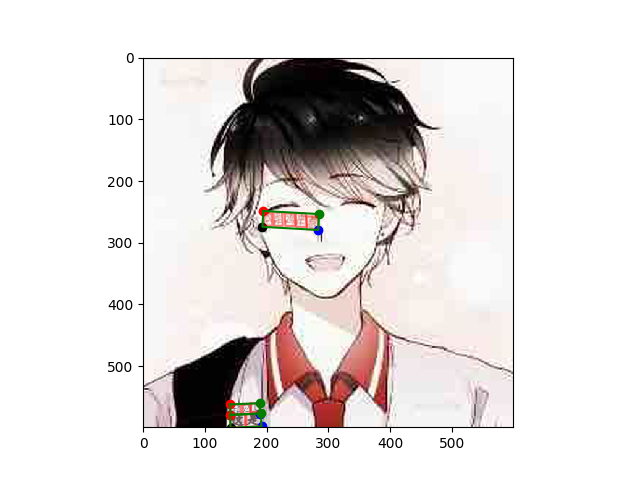
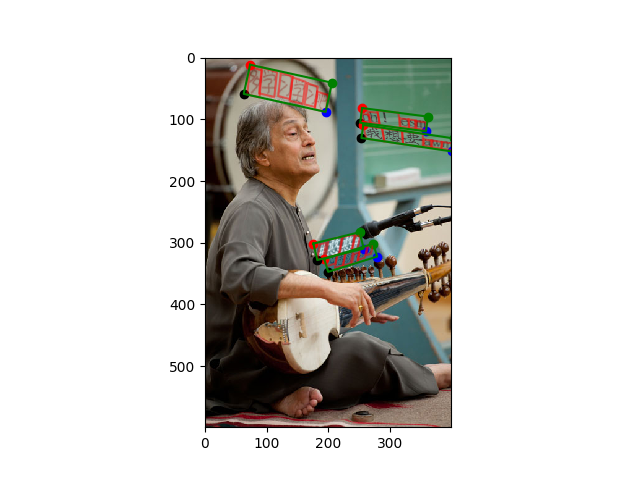
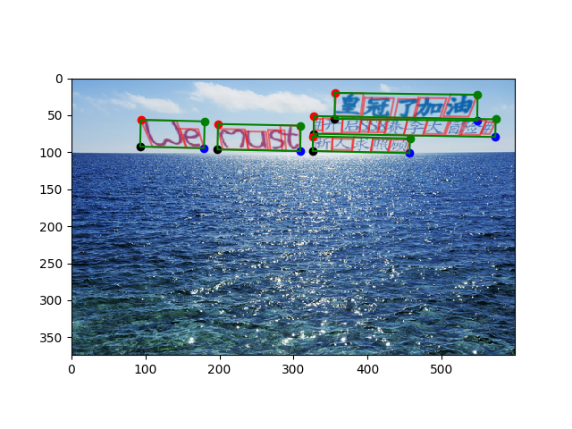

# SynthText中文合成

根据 https://github.com/ankush-me/SynthText.git 和 https://github.com/JarveeLee/SynthText_Chinese_version

**效果示例图**





==需要使用`python2.7`, 并且依赖满足`requirement.txt`==

## 合成

**合成**图片:

```
python gen.py --homograph 0.1 --vertical 0.2 --rotated 0.2 --curved 0.1 --contrast 0.8 --opaque 0.8
```

其中：

- `homograph` 调整自然场景嵌入字体的比例
- `vertical` 调整竖排字的比例
- `rotated` 调整字旋转的比例
- `curved` 调整字弧形排列的比例
- `contrast` 调整字体颜色对比度的比例
- `opaque` 调整字体透明度的比例

(以上实例的值均为默认值)

**渲染**并**保存**已合成图片

```python
python visualize_results.py
```

- 默认输出文件夹为`out_images`

- 可更改：字符集标注，字段级标注，是否隐藏数轴

  ```python
  plot_charBB = True
  plot_wordBB = True
  hide_axis = True
  ```

## 所需材料

1. 字体文件

   - 需要放入`fonts` 文件夹，并且在`fonts/fontlist.txt` 中指定字体的路径

     *示例*：

     ```bash
     fonts
     ├───more_fonts
         ├───华文隶书.TTF
     ```

     则在`fonts/fontlist.txt`里加入：

     ```text
     more_font/华文隶书.TTF
     ```

   - 运行`invert_font_size.py` 将字体转为`font_px2pt.cp`，输出到`data/models`

2. 语料

   - 放入`data/game_texts`

3. 图片

   - 放入`data/game_dset/images/results` 

4. 图片的depth map

   - 需要使用`matlab`和https://bitbucket.org/fayao/dcnf-fcsp/src/master/计算步骤3的图片的depth map

     - 需要配置安装`vlfeat`和`matconvnet`

   - 运行`prep_scripts/predict_depth.m` 计算，输出`depth.h5`

     - 需要自行更改`dir_matConvNet`等路径
     - 输出路径为`opts.out_h5 = '/path/to/save/output/depth.h5';`

     以上所有相关路径在`prep_scripts/predict_depth.m`为

     ```matlab
     run( '\code\dcnf-fcsp\libs\vlfeat-0.9.18\toolbox\vl_setup');
     dir_matConvNet='\code\matconvnet-1.0-beta20\matlab\';  
     opts.imdir = '\code\images\2021-05-11';
     opts.out_h5 = '\code\result\depth.h5';
     ```

5. 图片的segmentation map

   - 对步骤3的图片运行`prep_scripts/run_ucm.m`，输出 `ucm.mat`

     - 需要下载`VOC2012`数据集https://deepai.org/dataset/pascal-voc和安装https://github.com/jponttuset/mcg

     - 安装成功后更改`prep_scripts/run_ucm.m`中以下路径

       ```matlab
       img_dir = '../../depth_seg_images/2021-05-11';
       mcg_dir = '/code/tmp/mcg/pre-trained';
       ```

   - 运行`prep_scrips/floodFill.py`，使用`ucm.mat`输出`seg.h5`

6. `data/models/colors_new.cp`和`data/models/char_freq.cp`

   - 可以从http://www.robots.ox.ac.uk/~ankush/data.tar.gz下载并且放入`data/models`文件夹
